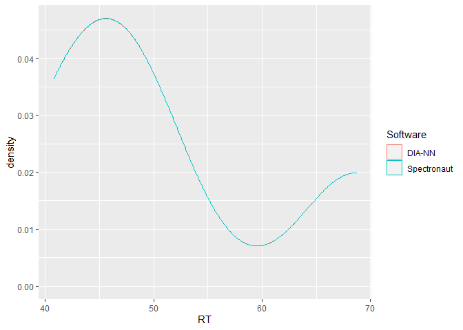

<!-- README.md is generated from README.Rmd. Please edit that file -->

# flowTraceR 

<!-- badges: start -->

[](https://github.com/OKdll/flowTraceR/actions)
[](https://CRAN.R-project.org/package=flowTraceR)
<!-- badges: end -->

flowTraceR is an R package for enabling researchers to perform
inter-software comparisons for common proteomic software tools. It can
be used to analyze label-free mass spectrometry-based experiments with
data-dependent or data-independent spectral acquisition.

## Installation

Install the development version from
[GitHub](https://github.com/OKdll/flowTraceR) using the
[`devtools`](https://github.com/r-lib/devtools) package by using the
following commands:

``` r
# install.packages("devtools") #remove "#" if you do not have devtools package installed yet
devtools::install_github("OKdll/flowTraceR", dependencies = TRUE) # use dependencies TRUE to install all required packages for flowTraceR
```

## Preparation

### Requirements

As input the standard outputs of ProteomeDiscoverer, Spectronaut, DIA-NN
or MaxQuant are supported by flowTraceR. Details about further
requirements are listed in the vignette
[Requirements](https://okdll.github.io/flowTraceR/articles/Requirements.html).

### Import

Importing the output files from each software can be easily performed
with `data.table::fread()`.

``` r
diann <- data.table::fread("DIRECTORY/dia-nn_file.tsv")
spectronaut <- data.table::fread("DIRECTORY/spectronaut_file.tsv")
mq_evidence <- data.table::fread("DIRECTORY/maxquant_evidence.txt")
mq_proteinGroups <- data.table::fread("DIRECTORY/maxquant_proteinGroups.txt")
pd_psm <- data.table::fread("DIRECTORY/pd_PSMs.txt")
```

### Load packages

``` r
#load libraries

library(flowTraceR)
library(magrittr) 
library(dplyr)
library(tidyr)
library(stringr)
library(tibble)
library(ggplot2)
library(data.table)
library(kableExtra)
```

## Example - trace proteinGroups

This is a basic example which demonstrates how to trace inter-software
differences in proteinGroup denotations for common precursor
identifications. Please check the vignette
[Workflow](https://okdll.github.io/flowTraceR/articles/Workflow.html)
for a detailed analysis pipeline and more functionalities.

``` r
#DIA-NN
diann <- get_example("DIA-NN")
#Spectronaut
spectronaut <- get_example("Spectronaut")

#convert to standardized format
diann_all_converted <- convert_all_levels(input_df = diann, software = "DIA-NN")
spectronaut_all_converted <- convert_all_levels(input_df = spectronaut, software = "Spectronaut")

#trace identifications in binary comparison
traced_all <- trace_all_levels(input_df1 = diann_all_converted, input_df2 = spectronaut_all_converted, analysis_name1 = "DIA-NN", analysis_name2 = "Spectronaut", filter_unknown_mods = TRUE)

#connect traced levels - proteinGroups_precursor
DIANN_connected_proteinGroup <- connect_traceR_levels(input_df = traced_all[["DIA-NN"]], level = "proteinGroups")
Spectronaut_connected_proteinGroup <- connect_traceR_levels(input_df = traced_all[["Spectronaut"]], level = "proteinGroups")

#trace differences in proteinGroup dentotation for common precursor identification
Difference_proteinGroup <- trace_unique_common_pg(input_df1 = DIANN_connected_proteinGroup, input_df2 = Spectronaut_connected_proteinGroup, analysis_name1 = "DIA-NN", analysis_name2 = "Spectronaut", string_analysis = TRUE)
```

The table shows differences of proteingroup denotations for common
precursor (`traceR_precursor`) for DIA-NN
(`traceR_proteinGroups_DIA-NN`) and Spectronaut
(`traceR_proteinGroups_Spectronaut`).

``` r
kableExtra::kable(Difference_proteinGroup, format = "pipe", caption = "Difference in proteinGroup denotation")
```

| traceR\_proteinGroups\_DIA-NN | traceR\_precursor      | traceR\_proteinGroups\_Spectronaut |
|:------------------------------|:-----------------------|:-----------------------------------|
| P01764                        | AEDTAVYYC(UniMod:4)AK2 | A0A0J9YY99                         |
| Q92496                        | EGIVEYPR2              | Q02985                             |

Difference in proteinGroup denotation

## Example - Inter-software comparison of retention times

This is a basic example which shows the power of flowTraceR´s conversion
to a standardized level (precursor, modified peptides, proteinGroup)
output by highlighting an inter-software comparison of retention times.
Please check the vignette
[Example\_RT\_distribution](https://okdll.github.io/flowTraceR/articles/Example_RT_distribution.html)
for a detailed view of the analysis **with flowTraceR** and **without
flowTraceR**.

``` r
#DIA-NN
diann <- get_example("RetentionTime")[["DIA-NN"]]
#Spectronaut
spectronaut <- get_example("RetentionTime")[["Spectronaut"]]

#flowTraceR - Conversion
diann_all_converted <- convert_all_levels(input_df = diann, software = "DIA-NN")
spectronaut_all_converted <- convert_all_levels(input_df = spectronaut, software = "Spectronaut")

#Get common entries
diann_common_traceR <- dplyr::semi_join(
  diann_all_converted,
  spectronaut_all_converted,
  by = c("traceR_precursor"))

spectronaut_common_traceR <- dplyr::semi_join(
  spectronaut_all_converted,
  diann_all_converted,
  by = c("traceR_precursor")) %>% 
  dplyr::rename(RT = EG.ApexRT)

#Combine
RT_common <- dplyr::bind_rows(
  "DIA-NN" = diann_common_traceR[,"RT"],
  Spectronaut = spectronaut_common_traceR[, "RT"],
  .id = "Software")

#Plot
ggplot2::ggplot(RT_common, aes(x = RT, color = Software)) + 
  geom_density()
```


